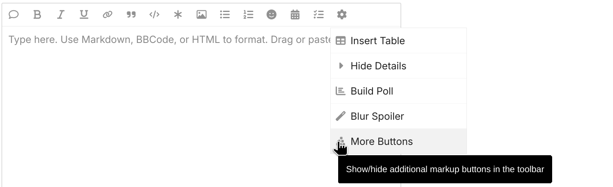
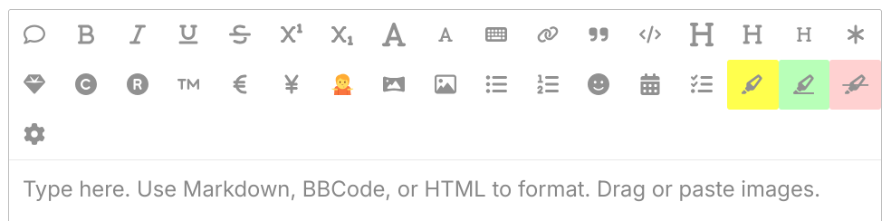

# Composer Button Bonanza for Discourse

###  *"Composer Affordances that You Can Afford!"*

**Composer Button Bonanza** is a [Discourse](https://www.discourse.org/)
theme component which provides more markup buttons for the Composer UI
(the interface for composing posts and messages).

Out-of-the-box, it provides a slew of new buttons, a mess of buttons,
a _bonanza_ of buttons.  However, via the theme component configuration
settings, you can:
 * add new button definition (and/or remove the provided ones);
 * select which buttons to show, and when to show them;
 * change the ordering of buttons, and place buttons in the toolbar or
   the toolbar’s ⚙️ pop-up menu;
 * provide translations/localizations for the buttons.

This component does not *define* any new markup or styling --- it merely adds
convenient buttons (affordances!) to type out existing markup that will invoke
existing styles.  Its primary purpose is to help users to discover and use
Composer functionality.  E.g., users who use a lot of footnotes will
probably just bang the `^[` and `]` directly on the keyboard; but the rest
of us will be happy to have an *️⃣️ button to remind us what to do.

A benefit of this approach is that if you decide to remove this theme
component, you will not disturb the styling of any existing posts.  This
component is not responsible for doing any styling; it just provides
shortcuts to functionality already in the Composer, and/or provided by other
plugins or theme components.

---

**Brought to you by...** 

This theme component is developed by the
[Center for Transparent Analysis and Policy](https://www.centertap.org/),
a 501(c)(3) non-profit organization.  If this component is useful
for your site, consider
**[making a donation to support CTAP](https://www.centertap.org/how)**.
*You can't afford not to!*

---

 * [Default Configuration](#default-configuration)
 * [Release Notes](#release-notes)
 * [License](#license)

---

## Default Configuration

The default configuration adds three new buttons to the toolbar, and hides
the rest behind a toggle button in the :gear: popup menu:

After clicking on the toggle button, the rest of the buttons become visible:

All told, the default configuration provides definitions for all the extra
markup that is available on a default Discourse installation (with all the
built-in plugins enabled, and no extra plugins installed):
 * Text styles:
   * <u>underline</u>, ~~strike-through~~
   * superscript and subscript
   * <big>big text</big>, <small>small text</small>
   * <kbd>keyboard-style</kbd>
 * Formatting
   * <big><b>Heading 1</b></big>, <b>Heading 2</b>, <small><b>Heading 3</b></small>
   * Footnote
   * <ruby>Ruby text<rp>(</rp><rt>e.g., furigana</rt><rp>)</rp></ruby>
   * Image via external URL
   * Checklist
   * <mark>Highlighted</mark>, <ins>Inserted</ins>, <del>Deleted</del> text
 * Symbols
   * Copyright ©, Registered ®, Trademark™
   * Euro €, Yen ¥
   * the "shrug" kaomoji (because, why not? ¯\\\_(ツ)\_/¯ )
 * and, a toggle button to show/hide most of the above buttons

As mentioned earlier, these are merely the defaults.  All of these buttons can
be rearranged or removed, and new ones can be added.

---

## Release Notes

See [`RELEASE-NOTES.md`](RELEASE-NOTES.md).

---

## License

This work is licensed under GPL 3.0 (or any later version).

`SPDX-License-Identifier: GPL-3.0-or-later`

Copyright 2025 Matt Marjanovic
